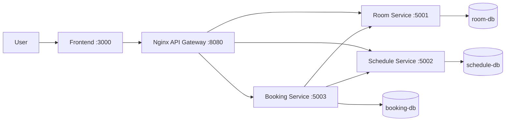

# Campus RoomFlow

Hệ thống demo microservices cho nghiệp vụ đặt phòng học trong trường đại học.
Frontend gọi API Gateway, gateway định tuyến request đến các backend service, mỗi
service sở hữu database riêng.

## Thông tin nhóm

| Họ và tên | MSSV | Vai trò | Phần công việc phụ trách |
|-----------|------|---------|---------------------------|
| .................... | .................... | Thành viên 1 | `room-service`, `room-db`, `docs/api-specs/room-service.yaml`, `services/room-service/readme.md` |
| .................... | .................... | Thành viên 2 | `schedule-service`, `schedule-db`, `docs/api-specs/schedule-service.yaml`, `services/schedule-service/readme.md` |
| .................... | .................... | Thành viên 3 | `booking-service`, `booking-db`, `gateway`, `frontend`, `docs/api-specs/booking-service.yaml`, `services/booking-service/readme.md`, tích hợp toàn hệ thống |

> Nhóm tự điền họ tên và MSSV vào từng dòng trước khi nộp bài.

## Business Process

Sinh viên tra cứu phòng học, gửi yêu cầu đặt phòng theo khung giờ. Quản trị viên
xem danh sách booking, phê duyệt, từ chối hoặc hủy booking. Hệ thống đảm bảo
booking đi qua gateway và các backend service được tách theo trách nhiệm nghiệp vụ.

## Technology Stack

| Phần | Công nghệ |
|------|-----------|
| Frontend | HTML, CSS, JavaScript thuần, Bootstrap |
| API Gateway | Nginx Reverse Proxy |
| Backend services | Node.js, Express, TypeScript |
| Database | PostgreSQL |
| API | HTTP/REST, OpenAPI 3.0 YAML |
| Static file runtime | BusyBox httpd |
| Deployment | Docker, Docker Compose |
| Service discovery | Docker Compose DNS / service names |

## Architecture



| Component | Responsibility | Tech Stack | Port |
|-----------|----------------|------------|------|
| Frontend | Giao diện tra cứu phòng, tạo booking, xử lý admin | HTML/CSS/JS, Bootstrap | 3000 |
| Gateway | Điểm vào duy nhất, reverse proxy request đến backend | Nginx | 8080 |
| Room Service | Quản lý thông tin phòng học | Node.js, Express, TypeScript | 5001 |
| Schedule Service | Quản lý availability, reserve, release slot | Node.js, Express, TypeScript | 5002 |
| Booking Service | Quản lý vòng đời booking và điều phối nghiệp vụ | Node.js, Express, TypeScript | 5003 |
| Databases | Database per service | PostgreSQL | 5433-5435 |

## Quick Start

```bash
docker compose up --build
```

Kiểm tra nhanh:

```bash
curl http://localhost:8080/health
curl http://localhost:5001/health
curl http://localhost:5002/health
curl http://localhost:5003/health
```

Frontend chạy tại:

```text
http://localhost:3000
```

Gateway chạy tại:

```text
http://localhost:8080
```

## Gateway Routes

| Public route | Upstream service |
|--------------|------------------|
| `/api/rooms...` | `room-service:5000` |
| `/api/schedules...` | `schedule-service:5000` |
| `/api/bookings...` | `booking-service:5000` |

## Documentation

| Document | Description |
|----------|-------------|
| `GETTING_STARTED.md` | Setup và workflow |
| `docs/analysis-and-design.md` | Phân tích và thiết kế |
| `docs/architecture.md` | Kiến trúc hệ thống |
| `docs/api-specs/` | OpenAPI 3.0 specifications |
