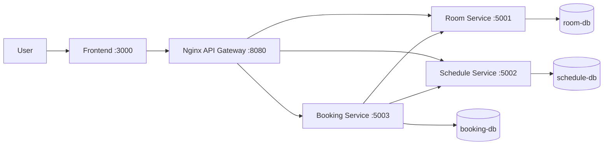

# Campus RoomFlow

He thong demo microservices cho nghiep vu dat phong hoc trong truong dai hoc.
Frontend goi API Gateway, gateway dinh tuyen request den cac backend service, moi
service so huu database rieng.

## Team Members

| Name | Student ID | Role | Contribution |
|------|------------|------|--------------|
|      |            |      |              |

## Business Process

Sinh vien tra cuu phong hoc, gui yeu cau dat phong theo khung gio. Quan tri vien
xem danh sach booking, phe duyet, tu choi hoac huy booking. He thong dam bao
booking di qua gateway va cac backend service duoc tach theo trach nhiem nghiep vu.

## Technology Stack

| Phan | Cong nghe |
|------|-----------|
| Frontend | HTML, CSS, JavaScript thuan, Bootstrap |
| API Gateway | Nginx Reverse Proxy |
| Backend services | Node.js, Express, TypeScript |
| Database | PostgreSQL |
| API | HTTP/REST, OpenAPI 3.0 YAML |
| Static file runtime | BusyBox httpd |
| Deployment | Docker, Docker Compose |
| Service discovery | Docker Compose DNS / service names |

## Architecture



| Component | Responsibility | Tech Stack | Port |
|-----------|----------------|------------|------|
| Frontend | Giao dien tra cuu phong, tao booking, xu ly admin | HTML/CSS/JS, Bootstrap | 3000 |
| Gateway | Diem vao duy nhat, reverse proxy request den backend | Nginx | 8080 |
| Room Service | Quan ly thong tin phong hoc | Node.js, Express, TypeScript | 5001 |
| Schedule Service | Quan ly availability, reserve, release slot | Node.js, Express, TypeScript | 5002 |
| Booking Service | Quan ly vong doi booking va dieu phoi nghiep vu | Node.js, Express, TypeScript | 5003 |
| Databases | Database per service | PostgreSQL | 5433-5435 |

## Quick Start

```bash
docker compose up --build
```

Kiem tra nhanh:

```bash
curl http://localhost:8080/health
curl http://localhost:5001/health
curl http://localhost:5002/health
curl http://localhost:5003/health
```

Frontend chay tai:

```text
http://localhost:3000
```

Gateway chay tai:

```text
http://localhost:8080
```

## Gateway Routes

| Public route | Upstream service |
|--------------|------------------|
| `/api/rooms...` | `room-service:5000` |
| `/api/schedules...` | `schedule-service:5000` |
| `/api/bookings...` | `booking-service:5000` |

## Documentation

| Document | Description |
|----------|-------------|
| `GETTING_STARTED.md` | Setup va workflow |
| `docs/analysis-and-design.md` | Phan tich va thiet ke |
| `docs/architecture.md` | Kien truc he thong |
| `docs/api-specs/` | OpenAPI 3.0 specifications |
