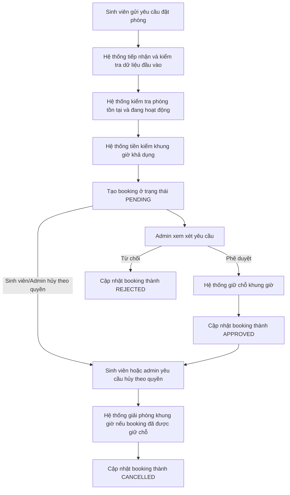
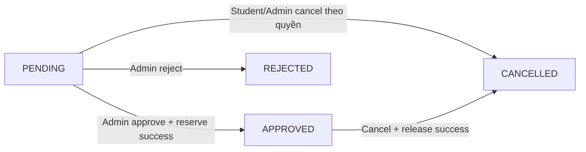
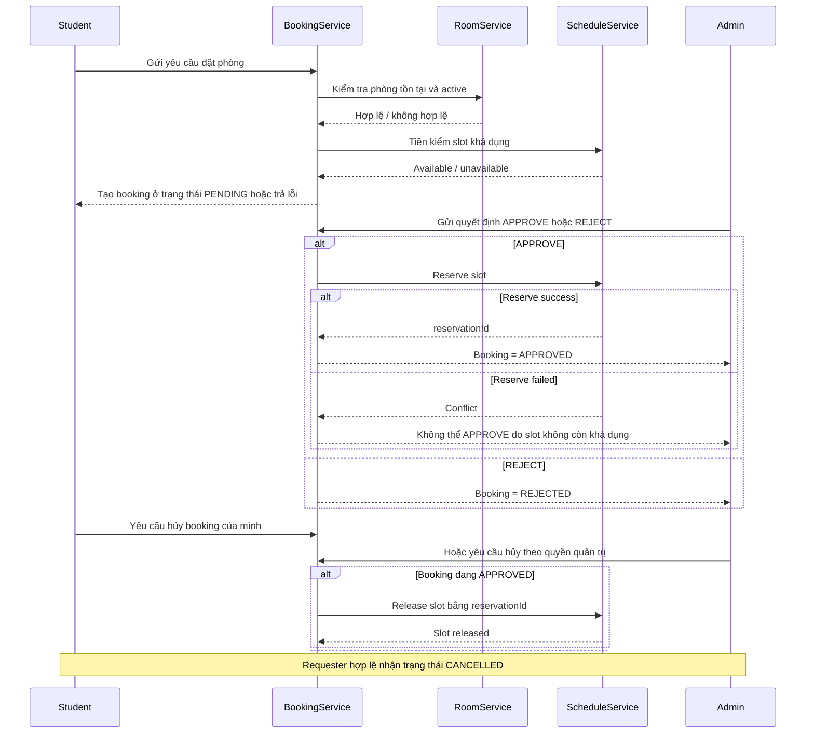
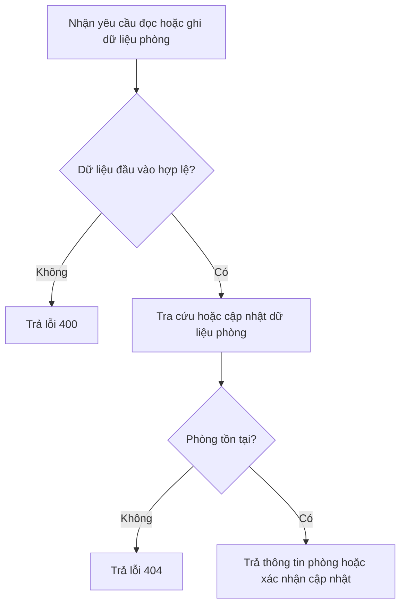
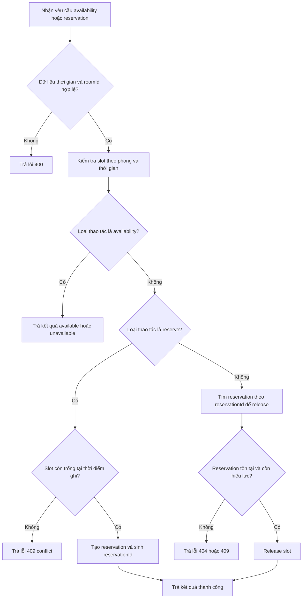
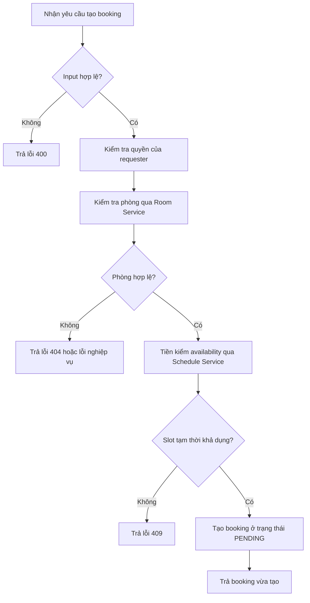
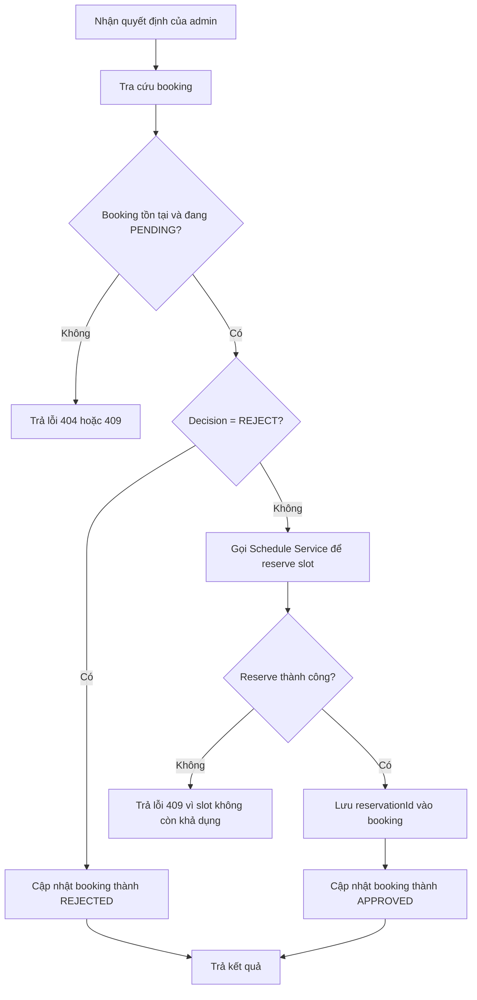
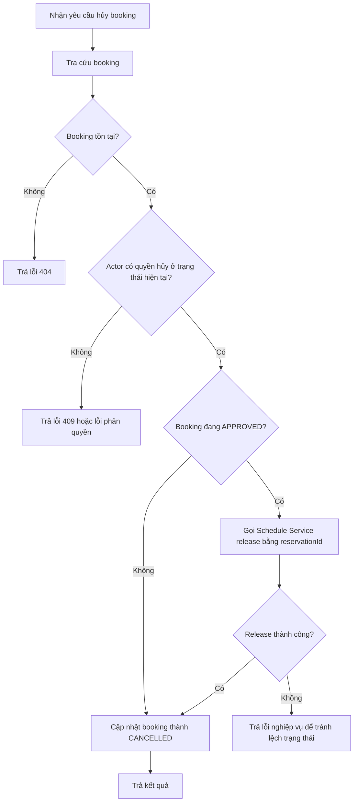

# Phân tích và Thiết kế - Giải pháp tự động hóa quy trình nghiệp vụ

> **Mục tiêu**: Phân tích một quy trình nghiệp vụ cụ thể và đề xuất cách tách dịch vụ theo hướng SOA/Microservices.
> Phạm vi tài liệu này tập trung vào **Phase 1 - Analysis & Design ở mức nghiệp vụ**. Tài liệu cố tình làm rõ quy tắc nghiệp vụ, trạng thái và ranh giới dịch vụ để khi sang Phase 2 không bị mơ hồ, nhưng chưa đi vào kiến trúc triển khai chi tiết hay OpenAPI hoàn chỉnh.

**Tài liệu tham khảo:**
1. *Service-Oriented Architecture: Analysis and Design for Services and Microservices* - Thomas Erl (2nd Edition)
2. *Microservices Patterns: With Examples in Java* - Chris Richardson
3. *Bài tập - Phát triển phần mềm hướng dịch vụ* - Hung Dang

---

## Part 1 - Analysis Preparation

### 1.1 Business Process Definition

Mô tả quy trình nghiệp vụ mức cao cần được tự động hóa.

- **Problem Statement**: Việc đăng ký mượn phòng học hiện có thể đang được xử lý thủ công qua tin nhắn, biểu mẫu rời rạc hoặc bảng tính. Cách làm này làm tăng nguy cơ trùng lịch, khó kiểm tra phòng có thực sự tồn tại và đang hoạt động hay không, đồng thời gây khó khăn cho admin khi theo dõi trạng thái từng yêu cầu.
- **Business Goals**:
  - Chuẩn hóa quy trình gửi, duyệt, từ chối và hủy yêu cầu đặt phòng học.
  - Giảm xung đột lịch bằng cách tách riêng trách nhiệm kiểm tra phòng, kiểm tra khả dụng và quản lý vòng đời booking.
  - Giúp sinh viên biết sớm yêu cầu có hợp lệ về mặt dữ liệu và tài nguyên hay không.
  - Giúp admin theo dõi, ra quyết định và truy vết trạng thái yêu cầu rõ ràng.
  - Tạo nền tảng phù hợp để tách hệ thống thành các service độc lập ở các phase sau.
- **Domain**: Hệ thống đặt phòng học (Classroom Room Booking System).
- **Business Process**: Sinh viên gửi yêu cầu đặt một phòng học cho một ngày và khung giờ cụ thể. Hệ thống tiếp nhận yêu cầu, kiểm tra dữ liệu đầu vào, kiểm tra phòng có tồn tại và còn hoạt động, tiền kiểm khung giờ có khả dụng hay không, sau đó tạo yêu cầu ở trạng thái chờ xử lý. Admin xem xét và ra quyết định phê duyệt hoặc từ chối. Nếu yêu cầu được phê duyệt thì hệ thống giữ chỗ khung giờ tương ứng; nếu yêu cầu bị hủy sau khi đã được duyệt thì hệ thống giải phóng khung giờ đó.
- **Actors**: Sinh viên, Quản trị viên (Admin), Hệ thống đặt phòng.
- **Scope**: Chỉ xử lý use case đặt một phòng học cho một ngày và một khoảng thời gian liên tục, kèm các luồng tạo yêu cầu, duyệt, từ chối, hủy và giải phóng khung giờ khi cần.
- **Business Process Overview**: Hệ thống đóng vai trò hỗ trợ và điều phối quy trình đặt phòng. Sinh viên là người khởi tạo yêu cầu. Hệ thống không tự đưa ra quyết định phê duyệt mà chỉ thực hiện các kiểm tra tự động và lưu vết trạng thái. Quyết định phê duyệt hoặc từ chối vẫn do admin thực hiện. Một yêu cầu chỉ được xem là phê duyệt thành công khi thao tác giữ chỗ khung giờ thành công; ngược lại, hệ thống không được phép đánh dấu yêu cầu là `APPROVED`.

**Process Diagram:**

### 1.2 Existing Automation Systems

Các hệ thống hiện hữu liên quan đến quy trình này.

| System Name | Type | Current Role | Interaction Method |
|-------------|------|--------------|-------------------|
| Chưa có hệ thống chuyên biệt | Thủ công | Tiếp nhận yêu cầu, kiểm tra lịch và phản hồi bằng thao tác thủ công | Trao đổi trực tiếp, biểu mẫu rời rạc hoặc bảng tính |

> Có thể xem đây là quy trình gần như chưa được tự động hóa tập trung.

### 1.3 Non-Functional Requirements

Các yêu cầu phi chức năng làm đầu vào cho việc xác định service candidates và các ranh giới dữ liệu.

| Requirement | Description |
|-------------|-------------|
| Performance | Các thao tác đọc đơn lẻ như tra cứu phòng hoặc kiểm tra availability nên phản hồi dưới khoảng 2 giây trong điều kiện demo bình thường; các thao tác tạo booking hoặc ra quyết định nên hoàn thành dưới khoảng 3 giây nếu không có lỗi nghiệp vụ. |
| Security | Phải phân biệt tối thiểu hai vai trò `Student` và `Admin`. Student được tạo và theo dõi booking của mình; Admin được phê duyệt, từ chối hoặc hủy theo chính sách nghiệp vụ. |
| Scalability | Có thể phát sinh nhiều yêu cầu gần nhau cho cùng một khung giờ, đặc biệt vào đầu học kỳ hoặc trước các sự kiện học tập. Trách nhiệm kiểm tra slot và giữ chỗ cần được tách riêng để dễ scale. |
| Availability | Dữ liệu phòng, booking và reservation phải được lưu bền vững ở mức tránh mất trạng thái quan trọng khi service/container khởi động lại. |
| Consistency | Một khung giờ của một phòng không được tồn tại đồng thời hai booking ở trạng thái `APPROVED`. Điểm kiểm soát cuối cùng phải nằm ở thao tác reserve slot tại thời điểm admin phê duyệt. |
| Auditability | Các quyết định quan trọng như phê duyệt, từ chối, hủy và thay đổi trạng thái cần có khả năng truy vết theo booking và actor thực hiện. |

### 1.4 Key Business Rules & Assumptions

Các quy tắc sau được chốt ngay từ Phase 1 để tránh mâu thuẫn khi sang thiết kế chi tiết:

1. Một booking chỉ hợp lệ nếu tham chiếu đến một phòng có tồn tại và đang ở trạng thái hoạt động.
2. Dữ liệu đầu vào tối thiểu của yêu cầu đặt phòng gồm `roomId`, `date`, `startTime`, `endTime`, `purpose`, `requesterId`.
3. Trong phạm vi hiện tại, `startTime` phải nhỏ hơn `endTime` và booking chỉ áp dụng cho một ngày duy nhất.
4. Việc kiểm tra availability tại thời điểm tạo booking chỉ là **tiền kiểm** để loại bỏ yêu cầu sai rõ ràng; điểm quyết định cuối cùng vẫn là thao tác reserve slot khi admin phê duyệt.
5. Một booking chỉ được chuyển sang `APPROVED` nếu thao tác reserve slot thành công. Nếu reserve thất bại vì xung đột, hệ thống không được ghi nhận booking là `APPROVED`.
6. Trạng thái `REJECTED` là trạng thái kết thúc và không kéo theo thao tác release slot vì slot chưa được giữ chỗ.
7. Quy tắc hủy được giả định như sau:
   - Student chỉ được hủy booking do chính mình tạo khi booking còn ở trạng thái `PENDING`.
   - Admin được hủy booking ở trạng thái `PENDING` hoặc `APPROVED`.
8. Nếu booking đang ở trạng thái `APPROVED`, hệ thống phải release slot trước khi cập nhật `CANCELLED`.
9. Khi reserve slot thành công, hệ thống phải lưu `reservationId` do service quản lý lịch trả về để phục vụ thao tác release sau này.
10. Các chuyển trạng thái không hợp lệ như `APPROVED -> REJECTED`, `REJECTED -> APPROVED`, `CANCELLED -> APPROVED` đều bị từ chối.

### 1.5 Booking State Model

Mô hình trạng thái ở mức nghiệp vụ:

Ghi chú:
- `PENDING` là trạng thái chờ quyết định, chưa khóa tài nguyên một cách chính thức.
- `APPROVED` là trạng thái đã giữ chỗ thành công.
- `REJECTED` và `CANCELLED` là các trạng thái kết thúc trong phạm vi hiện tại.

---

## Part 2 - REST/Microservices Modeling

### 2.1 Decompose Business Process & 2.2 Filter Unsuitable Actions

Phân rã quy trình thành các hành động nhỏ, đồng thời đánh dấu hành động nào không phù hợp để đóng gói thành service logic hoàn toàn tự động.

| # | Action | Actor | Description | Suitable? |
|---|--------|-------|-------------|-----------|
| 1 | Nhập thông tin yêu cầu đặt phòng | Sinh viên | Cung cấp mã phòng, ngày, giờ bắt đầu, giờ kết thúc và mục đích sử dụng | ✅ |
| 2 | Kiểm tra dữ liệu đầu vào | Hệ thống | Kiểm tra trường bắt buộc, định dạng ngày giờ, thời gian bắt đầu nhỏ hơn thời gian kết thúc | ✅ |
| 3 | Kiểm tra phòng có tồn tại và đang hoạt động | Hệ thống | Tra cứu thông tin phòng theo mã phòng được yêu cầu | ✅ |
| 4 | Tiền kiểm khung giờ còn trống | Hệ thống | Xác định sơ bộ phòng có đang rảnh ở ngày và giờ yêu cầu hay không | ✅ |
| 5 | Tạo yêu cầu đặt phòng ở trạng thái `PENDING` | Hệ thống | Lưu yêu cầu hợp lệ để admin xem xét | ✅ |
| 6 | Xem xét lý do và ra quyết định chấp thuận hay từ chối | Admin | Bước này chứa phán đoán nghiệp vụ của con người, không nên tự động hóa hoàn toàn | ❌ |
| 7 | Gửi quyết định phê duyệt | Admin | Admin xác nhận đồng ý cho yêu cầu cụ thể | ✅ |
| 8 | Reserve slot tại thời điểm phê duyệt | Hệ thống | Giữ chỗ khung giờ một cách chính thức để tránh trùng lịch | ✅ |
| 9 | Cập nhật trạng thái yêu cầu thành `APPROVED` | Hệ thống | Chỉ thực hiện sau khi reserve slot thành công | ✅ |
| 10 | Gửi quyết định từ chối | Admin | Admin xác nhận không chấp thuận yêu cầu | ✅ |
| 11 | Cập nhật trạng thái yêu cầu thành `REJECTED` | Hệ thống | Ghi nhận kết quả xử lý yêu cầu | ✅ |
| 12 | Gửi yêu cầu hủy booking | Sinh viên / Admin | Hủy một yêu cầu đã tạo hoặc đã được duyệt theo đúng quyền hạn | ✅ |
| 13 | Release slot đã reserve | Hệ thống | Trả lại slot cho lịch phòng nếu booking bị hủy sau khi đã được duyệt | ✅ |
| 14 | Cập nhật trạng thái yêu cầu thành `CANCELLED` | Hệ thống | Hoàn tất luồng hủy | ✅ |
| 15 | Kiểm tra tính hợp lệ của chuyển trạng thái | Hệ thống | Đảm bảo actor và trạng thái hiện tại cho phép thao tác tiếp theo | ✅ |
| 16 | Lưu `reservationId` tham chiếu trong booking | Hệ thống | Liên kết booking nghiệp vụ với reservation kỹ thuật để phục vụ release | ✅ |

> Hành động số 6 không phù hợp để encapsulate thành service logic vì đây là quyết định nghiệp vụ cần con người thực hiện. Hệ thống chỉ hỗ trợ ghi nhận quyết định và thực thi hệ quả của quyết định đó.

### 2.3 Entity Service Candidates

Nhóm các hành động có tính tái sử dụng cao quanh các thực thể nghiệp vụ cốt lõi.

| Entity | Service Candidate | Agnostic Actions |
|--------|-------------------|------------------|
| Room | Room Service | Tạo phòng, cập nhật thông tin phòng, lấy danh sách phòng, xem chi tiết phòng, kiểm tra phòng có tồn tại và đang hoạt động |
| Schedule Slot / Reservation | Schedule Service | Kiểm tra khả dụng theo phòng và thời gian, reserve slot, release slot, xem lịch đã giữ chỗ |

### 2.4 Task Service Candidate

Nhóm các hành động mang tính quy trình nghiệp vụ, không nên gộp vào Room Service hay Schedule Service.

| Non-agnostic Action | Task Service Candidate |
|---------------------|------------------------|
| Tiếp nhận yêu cầu đặt phòng từ sinh viên | Booking Service |
| Tạo yêu cầu ở trạng thái `PENDING` | Booking Service |
| Ghi nhận quyết định phê duyệt hoặc từ chối của admin | Booking Service |
| Quản lý vòng đời booking: `PENDING` -> `APPROVED` / `REJECTED` / `CANCELLED` | Booking Service |
| Điều phối với Schedule Service để reserve hoặc release slot theo trạng thái booking | Booking Service |
| Kiểm tra tính hợp lệ của transition trước khi đổi trạng thái | Booking Service |

> `Booking` cũng là một thực thể dữ liệu, nhưng trong bài toán này phần quan trọng nhất là vòng đời trạng thái và orchestration với các service khác. Vì vậy nó phù hợp hơn với vai trò **Task Service** thay vì chỉ là một Entity Service thuần CRUD.

### 2.5 Identify Resources

Ánh xạ thực thể và quy trình sang các REST resource ở mức khái niệm.

| Entity / Process | Resource URI |
|------------------|--------------|
| Danh sách phòng | `/rooms` |
| Chi tiết một phòng | `/rooms/{roomId}` |
| Kiểm tra khả dụng của phòng theo thời gian | `/schedules/availability` |
| Giữ chỗ một khung giờ | `/schedules/reservations` |
| Giải phóng một khung giờ đã giữ | `/schedules/reservations/{reservationId}` |
| Danh sách hoặc tạo yêu cầu đặt phòng | `/bookings` |
| Chi tiết một yêu cầu đặt phòng | `/bookings/{bookingId}` |
| Ghi nhận quyết định của admin | `/bookings/{bookingId}/decision` |
| Hủy một booking | `/bookings/{bookingId}/cancellation` |

### 2.6 Associate Capabilities with Resources and Methods

| Service Candidate | Capability | Resource | HTTP Method |
|-------------------|------------|----------|-------------|
| Room Service | Lấy danh sách phòng | `/rooms` | `GET` |
| Room Service | Lấy chi tiết phòng | `/rooms/{roomId}` | `GET` |
| Room Service | Tạo phòng mới | `/rooms` | `POST` |
| Room Service | Cập nhật thông tin phòng | `/rooms/{roomId}` | `PUT` |
| Schedule Service | Kiểm tra phòng còn trống theo khung giờ | `/schedules/availability` | `GET` |
| Schedule Service | Reserve một slot cho booking được duyệt | `/schedules/reservations` | `POST` |
| Schedule Service | Release slot khi booking bị hủy | `/schedules/reservations/{reservationId}` | `DELETE` |
| Booking Service | Tạo yêu cầu đặt phòng | `/bookings` | `POST` |
| Booking Service | Xem trạng thái một booking | `/bookings/{bookingId}` | `GET` |
| Booking Service | Xem danh sách booking theo trạng thái hoặc người gửi | `/bookings` | `GET` |
| Booking Service | Ghi nhận quyết định phê duyệt hoặc từ chối | `/bookings/{bookingId}/decision` | `POST` |
| Booking Service | Hủy booking | `/bookings/{bookingId}/cancellation` | `POST` |

**Ghi chú về identity và consistency**

- `POST /schedules/reservations` phải trả về `reservationId` nếu giữ chỗ thành công.
- `Booking Service` phải lưu `reservationId` khi booking chuyển sang `APPROVED`.
- `POST /bookings/{bookingId}/decision` chỉ hợp lệ khi booking đang ở trạng thái `PENDING`.
- Nhánh `APPROVE` chỉ hoàn tất khi reserve slot thành công; nếu reserve thất bại thì phải trả lỗi nghiệp vụ thay vì cập nhật sai trạng thái.

### 2.7 Utility Service & Microservice Candidates

Dựa trên yêu cầu phi chức năng và mức tự chủ nghiệp vụ, xác định các candidate cần được tách rõ.

| Candidate | Type (Utility / Microservice) | Justification |
|-----------|-------------------------------|---------------|
| Room Service | Microservice | Dữ liệu phòng là một miền rõ ràng, thay đổi độc lập và được nhiều quy trình sử dụng lại. |
| Schedule Service | Microservice | Logic kiểm tra trùng lịch, reserve và release slot cần tính nhất quán cao và có thể chịu tải độc lập. |
| Booking Service | Microservice | Vòng đời booking là logic quy trình nghiệp vụ chính, cần điều phối giữa Room Service và Schedule Service. |
| Authentication / Authorization | Utility | Cần thiết cho bảo mật nhưng giả định sẽ dùng cơ chế sẵn có của hệ thống trường hoặc gateway; chưa tách thành business service trong phạm vi hiện tại. |
| Notification | Utility | Có ích cho việc gửi thông báo duyệt hoặc hủy, nhưng chưa phải lõi nghiệp vụ của Phase 1 nên chưa chọn làm service riêng. |
| Audit Logging | Utility | Hữu ích để truy vết thao tác phê duyệt, từ chối, hủy và đối chiếu lịch sử thay đổi, nhưng chưa cần tách service riêng trong phạm vi hiện tại. |

### 2.8 Service Composition Candidates

Minh họa cách các service candidates phối hợp để hoàn thành use case chính.

**Candidate Services Summary**

| Service | Vai trò chính | Vì sao tách riêng? |
|---------|---------------|--------------------|
| Room Service | Quản lý thông tin phòng học | Thông tin phòng là dữ liệu nền, ổn định, có thể tái sử dụng cho nhiều use case khác ngoài booking. |
| Schedule Service | Quản lý khả dụng của phòng và trạng thái slot | Phần này chịu trách nhiệm tránh trùng lịch, cần logic chuyên biệt cho kiểm tra, reserve và release khung giờ. |
| Booking Service | Quản lý vòng đời yêu cầu đặt phòng | Đây là quy trình nghiệp vụ trung tâm, cần điều phối giữa kiểm tra phòng, kiểm tra lịch và quyết định của admin. |

**Giải thích cách chia thành 3 services**

Việc tách hệ thống thành 3 service giúp mỗi service sở hữu một nhóm trách nhiệm rõ ràng và hạn chế phụ thuộc chéo:

1. `Room Service` chỉ quản lý metadata của phòng như mã phòng, tên phòng, sức chứa, trạng thái hoạt động. Service này không chịu trách nhiệm lịch đặt hay trạng thái booking.
2. `Schedule Service` chỉ quản lý tính khả dụng của phòng theo thời gian. Service này không quyết định booking có được duyệt hay không, mà chỉ trả lời phòng còn trống hay không và thực hiện reserve/release slot.
3. `Booking Service` quản lý toàn bộ vòng đời yêu cầu đặt phòng từ lúc sinh viên gửi yêu cầu đến khi admin phê duyệt, từ chối hoặc hủy. Service này điều phối với 2 service còn lại nhưng không sở hữu dữ liệu chi tiết của phòng hay dữ liệu lịch khả dụng như nguồn dữ liệu gốc.

**Responsibilities of Each Service**

| Service | Responsibilities |
|---------|------------------|
| Room Service | Quản lý danh mục phòng; truy vấn phòng; xác nhận phòng có tồn tại và đang có thể sử dụng |
| Schedule Service | Kiểm tra khung giờ còn trống; reserve slot khi booking được duyệt; release slot khi booking bị hủy hoặc không còn hiệu lực |
| Booking Service | Tiếp nhận yêu cầu; lưu trạng thái booking; ghi nhận quyết định admin; kiểm tra transition hợp lệ; điều phối reserve/release slot; truy xuất trạng thái booking cho người dùng |

**High-level Service Interaction**

- Mọi request từ client liên quan đến use case đặt phòng đi vào `Booking Service`.
- `Booking Service` gọi `Room Service` để xác thực phòng trước khi tạo yêu cầu.
- `Booking Service` gọi `Schedule Service` để tiền kiểm khả dụng trước khi tạo `PENDING`.
- Khi admin phê duyệt, `Booking Service` phải gọi `Schedule Service` để reserve slot như bước kiểm soát cuối cùng trước khi cập nhật `APPROVED`.
- Khi booking bị hủy sau khi đã được duyệt, `Booking Service` phải gọi `Schedule Service` để release slot rồi mới cập nhật `CANCELLED`.
- `Room Service` và `Schedule Service` không trực tiếp quản lý vòng đời nghiệp vụ của booking.

**Assumptions and Scope Limitations**

- Chỉ xét đặt một phòng học cho một ngày và một khoảng thời gian liên tục.
- Chưa xử lý booking lặp lại theo tuần hoặc theo học kỳ.
- Chưa xử lý thiết bị đi kèm như máy chiếu, loa hoặc nhân sự hỗ trợ.
- Quyết định phê duyệt hoặc từ chối vẫn do admin thực hiện thủ công; hệ thống chỉ lưu và áp dụng kết quả.
- Cơ chế đăng nhập và phân quyền được giả định là có sẵn hoặc sẽ được xử lý ở lớp gateway / hạ tầng, không phân tích sâu trong tài liệu này.
- Chưa đưa notification, audit log chuyên biệt hoặc tích hợp hệ thống lịch bên ngoài vào phạm vi chính.
- Chưa bàn sâu đến chiến lược retry, timeout, circuit breaker hay asynchronous messaging vì chưa phải trọng tâm của Phase 1.

---

## Part 3 - Service-Oriented Design

> Ghi chú phạm vi: Đây vẫn là tài liệu Phase 1. Tuy nhiên, để tránh mơ hồ khi chuyển sang Phase 2, phần này chốt **hợp đồng ở mức resource** và **logic xử lý ở mức khái niệm**, chưa phải OpenAPI cuối cùng hay thiết kế kỹ thuật chi tiết.

### 3.1 Uniform Contract Design

Service contract định hướng cho từng service:

- `docs/api-specs/room-service.yaml`, `docs/api-specs/schedule-service.yaml`, và `docs/api-specs/booking-service.yaml` là các file đặc tả API cần được duy trì nhất quán với phân tích nghiệp vụ.
- Do bài toán đã tách thành 3 business services, Phase 2/3 phải duy trì đủ cả 3 file spec tương ứng để bảo đảm trace đầy đủ giữa phân tích nghiệp vụ và thiết kế API.
- Các mã phản hồi dưới đây là định hướng nghiệp vụ; khi viết OpenAPI chi tiết có thể bổ sung schema và error body tương ứng.

**Nguyên tắc mã phản hồi dùng chung**

- `200/201/204`: thao tác thành công.
- `400`: dữ liệu đầu vào không hợp lệ.
- `404`: không tìm thấy tài nguyên nghiệp vụ.
- `409`: xung đột trạng thái hoặc xung đột tài nguyên, ví dụ slot không còn khả dụng hoặc transition không hợp lệ.

**Room Service:**

| Endpoint | Method | Media Type | Response Codes |
|----------|--------|------------|----------------|
| `/rooms` | `GET` | `application/json` | `200` |
| `/rooms/{roomId}` | `GET` | `application/json` | `200`, `404` |
| `/rooms` | `POST` | `application/json` | `201`, `400`, `409` |
| `/rooms/{roomId}` | `PUT` | `application/json` | `200`, `400`, `404`, `409` |

**Schedule Service:**

| Endpoint | Method | Media Type | Response Codes |
|----------|--------|------------|----------------|
| `/schedules/availability` | `GET` | `application/json` | `200`, `400`, `404` |
| `/schedules/reservations` | `POST` | `application/json` | `201`, `400`, `404`, `409` |
| `/schedules/reservations/{reservationId}` | `DELETE` | `application/json` | `204`, `404`, `409` |

**Booking Service:**

| Endpoint | Method | Media Type | Response Codes |
|----------|--------|------------|----------------|
| `/bookings` | `POST` | `application/json` | `201`, `400`, `404`, `409` |
| `/bookings` | `GET` | `application/json` | `200` |
| `/bookings/{bookingId}` | `GET` | `application/json` | `200`, `404` |
| `/bookings/{bookingId}/decision` | `POST` | `application/json` | `200`, `400`, `404`, `409` |
| `/bookings/{bookingId}/cancellation` | `POST` | `application/json` | `200`, `400`, `404`, `409` |

**Ghi chú hợp đồng quan trọng**

- `POST /bookings` không được tự ý reserve slot; thao tác này chỉ tạo yêu cầu nghiệp vụ ở trạng thái `PENDING`.
- `POST /bookings/{bookingId}/decision` nhận quyết định của admin. Nếu action là `APPROVE`, service phải reserve slot thành công trước khi trả kết quả thành công.
- `POST /bookings/{bookingId}/cancellation` phải phân biệt hủy booking `PENDING` và hủy booking `APPROVED`.
- `DELETE /schedules/reservations/{reservationId}` dùng `reservationId` do Schedule Service sinh ra, không dùng mơ hồ giữa `bookingId` và `reservationId`.

### 3.2 Service Logic Design

Internal processing flow ở mức khái niệm cho từng service.

**Room Service:**

**Schedule Service:**

**Booking Service - Create Booking Flow**

**Booking Service - Decision Flow**

**Booking Service - Cancellation Flow**

**Tóm tắt logic trọng yếu cần được giữ nhất quán**

1. `Booking Service` là nơi giữ state machine nghiệp vụ của booking.
2. `Schedule Service` là nơi giữ tính nhất quán cuối cùng của slot và reservation.
3. `Room Service` không tham gia vào quyết định approve/reject, mà chỉ cung cấp sự thật về phòng.
4. Không service nào được truy cập trực tiếp database của service khác.
5. Quan hệ giữa booking và reservation phải được lưu rõ ràng để luồng hủy không bị mơ hồ.
