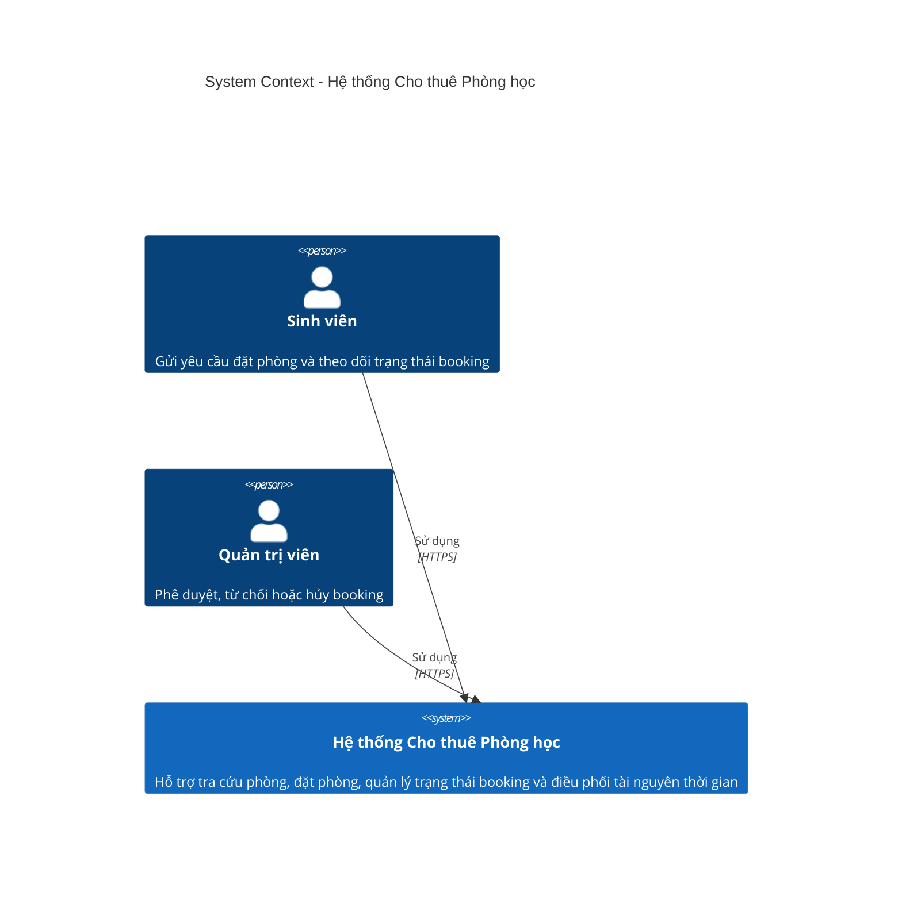
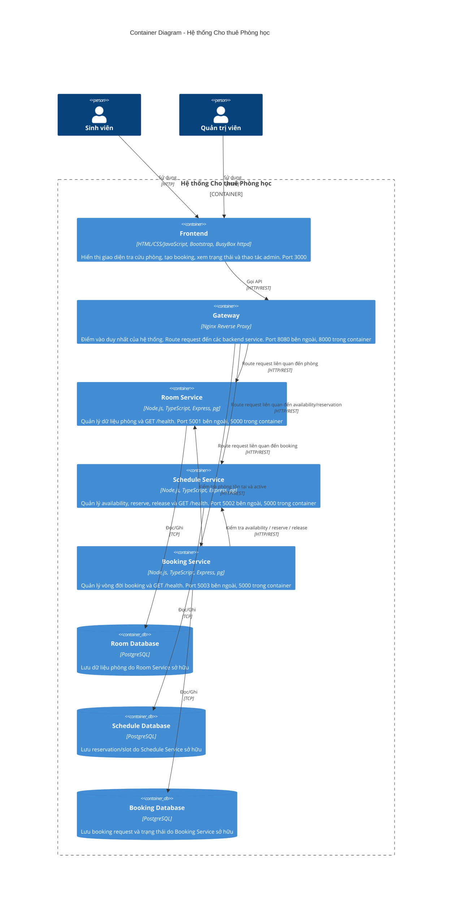
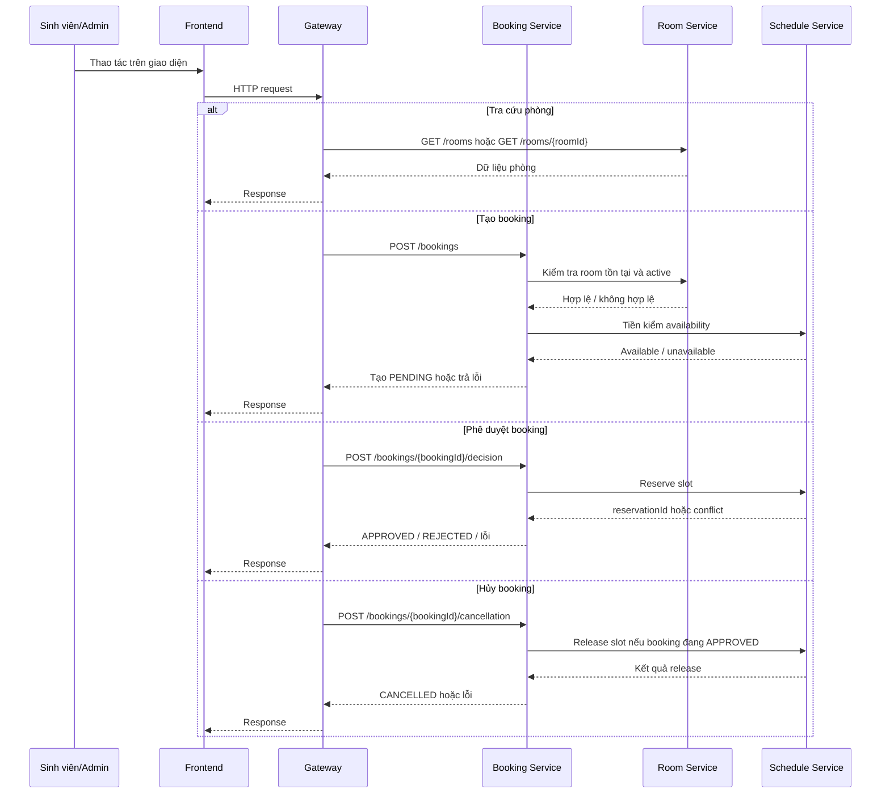

# Kiến trúc Hệ thống

> Tài liệu này được hoàn thiện **sau Phase 1 - Analysis & Design** và dùng để chuyển kết quả phân tích nghiệp vụ sang một kiến trúc triển khai cụ thể.
> Mục tiêu của kiến trúc là: **đúng nghiệp vụ, đủ chặt chẽ để bảo vệ khi nộp bài, dễ triển khai bằng Docker Compose, và phù hợp với nhóm 3 người bằng cách tách thành 3 service nghiệp vụ**.

**Tài liệu tham khảo:**

1. _Service-Oriented Architecture: Analysis and Design for Services and Microservices_ - Thomas Erl (2nd Edition)
2. _Microservices Patterns: With Examples in Java_ - Chris Richardson
3. _Bài tập - Phát triển phần mềm hướng dịch vụ_ - Hung Dang

---

## 0. Nguyên tắc kiến trúc được chốt

Kiến trúc cuối cùng của đồ án "cho thuê phòng học" được chốt theo hướng:

- `frontend`
- `gateway`
- `room-service`
- `schedule-service`
- `booking-service`
- `database per service`

Trong đó:

- `frontend` chỉ là giao diện, **không được tính là service nghiệp vụ**
- `gateway` là điểm vào hệ thống, cũng **không được tính là service nghiệp vụ**
- 3 service nghiệp vụ đúng để chia cho 3 người là:
  - `room-service`
  - `schedule-service`
  - `booking-service`

Điều này nhất quán với Phase 1 trong [`analysis-and-design.md`](analysis-and-design.md), nơi đã tách rõ:

1. quản lý thông tin phòng
2. quản lý khả dụng / reserve / release slot
3. quản lý vòng đời booking

### 0.1 Làm rõ với `docker-compose.yml` hiện tại

File [`docker-compose.yml`](../docker-compose.yml) ban đầu là **starter template**, chỉ có:

- `frontend`
- `gateway`
- `2 backend placeholder services`

Điều này **không phải kiến trúc cuối cùng của đồ án**, mà chỉ là bộ khung ban đầu. Khi triển khai thật, repo cần được đổi sang đúng tên nghiệp vụ:

- `room-service`
- `schedule-service`
- `booking-service`

Tài liệu này mô tả **kiến trúc mục tiêu cần đạt khi nộp đồ án**, không chỉ mô tả starter hiện có.

---

## 1. Lựa chọn Pattern

### 1.1 Tiêu chí lựa chọn

Pattern được chọn theo các tiêu chí:

- bám đúng business process trong Phase 1
- tách đúng 3 service nghiệp vụ để chia cho 3 người
- dễ triển khai trên Docker Compose
- tránh các thành phần phức tạp không cần thiết
- dễ đối chiếu giữa tài liệu phân tích, kiến trúc, API spec và code

### 1.2 Bảng lựa chọn pattern

| Pattern                           | Chọn? | Suy ra từ bước phân tích nào                                               | Giải thích nghiệp vụ / kỹ thuật                                                                                                                        |
| --------------------------------- | ----- | -------------------------------------------------------------------------- | ------------------------------------------------------------------------------------------------------------------------------------------------------ |
| API Gateway                       | Có    | Phase 1 - luồng tương tác client, `AGENTS.md`, `student-guide.md`          | Frontend không gọi trực tiếp backend service. Gateway là điểm vào duy nhất, giúp route request rõ ràng, dễ quản lý, dễ bảo vệ kiến trúc microservices. |
| Database per Service              | Có    | Phase 1 - NFR về Scalability, Availability, Consistency; `AGENTS.md`       | Mỗi service sở hữu dữ liệu riêng để tránh coupling, tăng tính độc lập và đúng tinh thần microservices.                                                 |
| Shared Database                   | Không | Mâu thuẫn với service ownership trong Phase 1 và ràng buộc của `AGENTS.md` | Nếu dùng chung database thì ranh giới service bị phá vỡ, khó chứng minh tính độc lập của từng service nghiệp vụ.                                       |
| Saga                              | Không | Phase 1 - luồng nghiệp vụ ngắn, ít bước, đồng bộ                           | Quy trình booking hiện tại đủ nhỏ để xử lý bằng REST đồng bộ. Dùng Saga sẽ làm giải pháp phức tạp quá mức cần thiết.                                   |
| Event-driven / Message Queue      | Không | Phase 1 - service composition chủ yếu theo request/response                | Chưa cần Kafka/RabbitMQ cho phạm vi bài tập. Bổ sung broker sẽ làm Docker Compose khó triển khai và khó demo hơn.                                      |
| CQRS                              | Không | Phase 1 - tải đọc/ghi thấp trong phạm vi đồ án                             | Chưa cần tách riêng read model / write model. Dùng REST đồng bộ sẽ dễ triển khai và dễ chấm hơn.                                                       |
| Circuit Breaker                   | Không | Phase 1 - hệ thống nhỏ, chạy nội bộ Docker Compose                         | Có thể hữu ích trong production lớn, nhưng không cần thiết cho bài tập triển khai cục bộ.                                                              |
| Service Registry / Discovery      | Không | Docker Compose đã cung cấp DNS nội bộ                                      | Các service gọi nhau trực tiếp bằng service names nên không cần Consul/Eureka.                                                                         |
| Synchronous REST giữa các service | Có    | Phase 1 - resource contracts, service composition, `docs/api-specs/*.yaml` | Đây là kiểu giao tiếp đơn giản nhất, dễ test nhất, dễ bám theo OpenAPI, và phù hợp với bài tập.                                                        |

### 1.3 Kết luận pattern

Kiến trúc được chọn là:

- `Frontend -> Gateway -> Backend Services`
- 3 backend service nghiệp vụ giao tiếp bằng **REST đồng bộ**
- mỗi service có **database riêng**
- không dùng broker, không dùng gRPC, không dùng registry

Đây là lựa chọn chặt chẽ nhất cho đồ án vì:

- đúng với phân tích nghiệp vụ
- đủ rõ để chia việc cho 3 người
- dễ code và dễ chạy bằng Docker
- ít rủi ro hơn các kiến trúc phức tạp

---

## 2. Thành phần Hệ thống

### 2.1 Danh sách thành phần triển khai

| Thành phần            | Trách nhiệm                                                                                                            | Công nghệ sử dụng                             | Port                                 |
| --------------------- | ---------------------------------------------------------------------------------------------------------------------- | --------------------------------------------- | ------------------------------------ |
| **Frontend**          | Giao diện cho sinh viên và admin: tra cứu phòng, gửi booking, xem trạng thái, phê duyệt / từ chối / hủy                | HTML, CSS, JavaScript thuần, Bootstrap; chạy file tĩnh bằng BusyBox httpd | 3000                                 |
| **Gateway**           | Điểm vào duy nhất của hệ thống; route request từ frontend đến các backend service                                      | Nginx Reverse Proxy                           | 8080 bên ngoài, 8000 trong container |
| **Room Service**      | Quản lý thông tin phòng học: mã phòng, tên phòng, sức chứa, trạng thái hoạt động, thông tin mô tả phòng                | Node.js 20 LTS, TypeScript, Express, pg       | 5001 bên ngoài, 5000 trong container |
| **Schedule Service**  | Quản lý availability, reserve slot, release slot, chống trùng lịch ở mức tài nguyên thời gian                          | Node.js 20 LTS, TypeScript, Express, pg       | 5002 bên ngoài, 5000 trong container |
| **Booking Service**   | Quản lý yêu cầu booking, trạng thái booking, phê duyệt / từ chối / hủy, điều phối với room-service và schedule-service | Node.js 20 LTS, TypeScript, Express, pg       | 5003 bên ngoài, 5000 trong container |
| **Room Database**     | Lưu dữ liệu phòng do room-service sở hữu                                                                               | PostgreSQL 16 Alpine                          | 5432 nội bộ, 5433 bên ngoài          |
| **Schedule Database** | Lưu reservation / slot / availability do schedule-service sở hữu                                                       | PostgreSQL 16 Alpine                          | 5432 nội bộ, 5434 bên ngoài          |
| **Booking Database**  | Lưu booking request, trạng thái, quyết định xử lý do booking-service sở hữu                                            | PostgreSQL 16 Alpine                          | 5432 nội bộ, 5435 bên ngoài          |

### 2.2 Vai trò của 3 service nghiệp vụ

#### `room-service`

Chỉ chịu trách nhiệm về **sự thật của phòng học**:

- phòng có tồn tại hay không
- phòng có đang active hay không
- phòng có sức chứa bao nhiêu
- thông tin phòng nào được phép sử dụng trong hệ thống

Service này **không được** quản lý trạng thái booking.

#### `schedule-service`

Chỉ chịu trách nhiệm về **sự thật của khung giờ / reservation**:

- phòng còn trống hay không trong khoảng thời gian yêu cầu
- reserve slot khi booking được duyệt
- release slot khi booking bị hủy
- bảo đảm không có hai reservation hợp lệ cùng chiếm một khung giờ của một phòng

Service này **không được** quyết định booking có được phê duyệt hay không.

#### `booking-service`

Chỉ chịu trách nhiệm về **vòng đời nghiệp vụ của booking**:

- tạo booking ở trạng thái `PENDING`
- ghi nhận `APPROVED`, `REJECTED`, `CANCELLED`
- kiểm tra tính hợp lệ của state transition
- gọi `room-service` và `schedule-service` để hoàn thành quy trình

Service này **không được** tự sở hữu dữ liệu phòng gốc hay tự quyết định availability nếu chưa hỏi `schedule-service`.

### 2.3 Quy tắc health check

Theo `AGENTS.md`, mọi service phải có:

```http
GET /health
```

và trả về:

```json
{ "status": "ok" }
```

Ít nhất các thành phần sau phải đáp ứng quy tắc này:

- `gateway`
- `room-service`
- `schedule-service`
- `booking-service`

Frontend không được tính là service nghiệp vụ, nhưng phải load giao diện thành công khi hệ thống chạy.

---

## 3. Giao tiếp giữa các thành phần

### 3.1 Nguyên tắc giao tiếp bắt buộc

1. Frontend **không gọi trực tiếp** `room-service`, `schedule-service`, `booking-service`.
2. Mọi request từ trình duyệt phải đi qua `gateway`.
3. `booking-service` là service điều phối nghiệp vụ trung tâm.
4. `booking-service` được phép gọi:
   - `room-service` để kiểm tra phòng tồn tại và đang active
   - `schedule-service` để kiểm tra availability, reserve, release
5. `room-service` và `schedule-service` không gọi trực tiếp database của service khác.
6. Không service nào được truy cập trực tiếp database của service khác.
7. Mọi inter-service call trong Docker phải dùng **service names**, không dùng `localhost`.

### 3.2 Ma trận giao tiếp

| Từ \ Đến             | Frontend | Gateway | Room Service | Schedule Service | Booking Service | Room DB | Schedule DB | Booking DB |
| -------------------- | -------- | ------- | ------------ | ---------------- | --------------- | ------- | ----------- | ---------- |
| **Frontend**         | —        | REST    | —            | —                | —               | —       | —           | —          |
| **Gateway**          | —        | —       | REST         | REST             | REST            | —       | —           | —          |
| **Room Service**     | —        | —       | —            | —                | —               | TCP     | —           | —          |
| **Schedule Service** | —        | —       | —            | —                | —               | —       | TCP         | —          |
| **Booking Service**  | —        | —       | REST         | REST             | —               | —       | —           | TCP        |
| **Room DB**          | —        | —       | —            | —                | —               | —       | —           | —          |
| **Schedule DB**      | —        | —       | —            | —                | —               | —       | —           | —          |
| **Booking DB**       | —        | —       | —            | —                | —               | —       | —           | —          |

### 3.3 Giải thích ma trận giao tiếp

- `Frontend -> Gateway = REST`
  - giao diện chỉ đi qua gateway
- `Gateway -> Room Service = REST`
  - phục vụ tra cứu danh sách phòng, chi tiết phòng, dữ liệu phòng
- `Gateway -> Schedule Service = REST`
  - có thể phục vụ admin/debug API nội bộ liên quan đến availability/reservation nếu cần
- `Gateway -> Booking Service = REST`
  - phục vụ tạo booking, xem booking, phê duyệt, từ chối, hủy
- `Booking Service -> Room Service = REST`
  - xác minh phòng tồn tại / active trước khi tạo booking
- `Booking Service -> Schedule Service = REST`
  - tiền kiểm availability trước khi tạo `PENDING`
  - reserve slot khi `APPROVE`
  - release slot khi `CANCEL`
- `Room Service -> Room DB = TCP`
- `Schedule Service -> Schedule DB = TCP`
- `Booking Service -> Booking DB = TCP`

### 3.4 Tính nhất quán với business process

Luồng nghiệp vụ được hiện thực như sau:

- sinh viên tìm phòng:
  - `Frontend -> Gateway -> Room Service`
- sinh viên gửi booking:
  - `Frontend -> Gateway -> Booking Service`
  - `Booking Service -> Room Service`
  - `Booking Service -> Schedule Service`
- admin phê duyệt:
  - `Frontend -> Gateway -> Booking Service`
  - `Booking Service -> Schedule Service` để reserve slot
- admin hoặc sinh viên hủy:
  - `Frontend -> Gateway -> Booking Service`
  - nếu booking đang `APPROVED` thì `Booking Service -> Schedule Service` để release slot

Như vậy:

- `Booking Service` giữ nghiệp vụ
- `Schedule Service` giữ tính nhất quán tài nguyên thời gian
- `Room Service` giữ dữ liệu phòng

---

## 4. Sơ đồ Kiến trúc

### 4.1 Sơ đồ ngữ cảnh hệ thống



### 4.2 Sơ đồ container triển khai



### 4.3 Sơ đồ luồng nghiệp vụ qua các service



---

## 5. Triển khai bằng Docker

### 5.1 Mô hình triển khai

Toàn bộ hệ thống được triển khai bằng Docker Compose:

- mỗi thành phần chạy trong container riêng
- các container giao tiếp qua Docker network nội bộ
- toàn hệ thống khởi động bằng:

```bash
docker compose up --build
```

### 5.2 Trạng thái starter hiện tại và mục tiêu cần hoàn thành

#### Starter hiện tại

`docker-compose.yml` ban đầu chỉ có:

- `frontend`
- `gateway`
- `2 backend placeholder services`

#### Kiến trúc mục tiêu cần hoàn thành ở Phase 3

Để đúng với tài liệu kiến trúc này, cần mở rộng thành:

- `frontend`
- `gateway`
- `room-service`
- `schedule-service`
- `booking-service`
- `room-db`
- `schedule-db`
- `booking-db`

Điều này là hoàn toàn hợp lệ vì starter repo chỉ là khung ban đầu; bài nộp cuối phải phản ánh đúng kiến trúc nhóm đã chọn.

### 5.3 Quy tắc networking trong Docker

Inter-service communication phải dùng service names:

- gateway gọi room-service:
  - `http://room-service:5000`
- gateway gọi schedule-service:
  - `http://schedule-service:5000`
- gateway gọi booking-service:
  - `http://booking-service:5000`
- booking-service gọi room-service:
  - `http://room-service:5000`
- booking-service gọi schedule-service:
  - `http://schedule-service:5000`

Không được dùng:

- `localhost`
- `127.0.0.1`

vì như vậy sẽ làm inter-service communication sai trong môi trường container.

### 5.4 Database per Service

Kiến trúc cuối cùng bắt buộc có:

- `room-db` dành riêng cho `room-service`
- `schedule-db` dành riêng cho `schedule-service`
- `booking-db` dành riêng cho `booking-service`

Quy tắc bắt buộc:

1. `room-service` chỉ đọc/ghi `room-db`
2. `schedule-service` chỉ đọc/ghi `schedule-db`
3. `booking-service` chỉ đọc/ghi `booking-db`
4. không có truy cập chéo giữa các database
5. không dùng shared database

### 5.5 Checklist sau triển khai

Sau khi hoàn thành Phase 3 và chạy `docker compose up --build`, hệ thống cần đạt:

1. Frontend truy cập được tại `http://localhost:3000`
2. Gateway truy cập được tại `http://localhost:8080`
3. Room service health check hoạt động:

```bash
curl http://localhost:5001/health
```

4. Schedule service health check hoạt động:

```bash
curl http://localhost:5002/health
```

5. Booking service health check hoạt động:

```bash
curl http://localhost:5003/health
```

6. Các phản hồi health check có dạng:

```json
{ "status": "ok" }
```

7. Frontend không gọi trực tiếp backend service
8. Các service nội bộ không dùng `localhost`
9. Mỗi service chỉ truy cập database của chính nó

---

## 6. Quan hệ với API Specs

Kiến trúc này sử dụng **REST đồng bộ** làm chuẩn giao tiếp chính.

| Luồng giao tiếp                     | Chuẩn     | Tài liệu liên quan                     |
| ----------------------------------- | --------- | -------------------------------------- |
| Frontend -> Gateway                 | HTTP/REST | Triển khai ở frontend + gateway        |
| Gateway -> Room Service             | HTTP/REST | `docs/api-specs/room-service.yaml`     |
| Gateway -> Schedule Service         | HTTP/REST | `docs/api-specs/schedule-service.yaml` |
| Gateway -> Booking Service          | HTTP/REST | `docs/api-specs/booking-service.yaml`  |
| Booking Service -> Room Service     | HTTP/REST | Suy ra từ business flow                |
| Booking Service -> Schedule Service | HTTP/REST | Suy ra từ business flow                |

### 6.1 Ghi chú bắt buộc về độ nhất quán

Do kiến trúc đã chọn là 3 service nghiệp vụ, khi sang Phase 2 nhóm bắt buộc phải:

1. cập nhật lại API specs để phản ánh đủ:
   - `room-service`
   - `schedule-service`
   - `booking-service`
2. cập nhật `docker-compose.yml` để phản ánh đúng 3 backend service
3. cập nhật route trong gateway
4. bảo đảm tên service dùng nhất quán giữa:
   - `analysis-and-design.md`
   - `architecture.md`
   - `docs/api-specs/*.yaml`
   - `docker-compose.yml`
   - code triển khai

Nếu không làm bước này, tài liệu sẽ đúng nhưng code/demo sẽ bị lệch so với kiến trúc.

---

## 7. Kết luận kiến trúc

Kiến trúc cuối cùng của đồ án "cho thuê phòng học" được chốt là:

- `frontend`
- `gateway`
- `room-service`
- `schedule-service`
- `booking-service`
- `database per service`

### 7.1 Vì sao đây là phương án phù hợp nhất

1. đúng với phân tích nghiệp vụ ở Phase 1
2. đáp ứng yêu cầu nhóm 3 người, mỗi người một service nghiệp vụ
3. phân tách trách nhiệm rõ ràng:
   - `room-service` giữ dữ liệu phòng
   - `schedule-service` giữ dữ liệu slot / reservation
   - `booking-service` giữ state machine nghiệp vụ
4. vẫn đủ đơn giản để chạy bằng Docker Compose
5. dễ bảo vệ trước giảng viên vì tài liệu có service boundaries rõ ràng

### 7.2 Kết luận ngắn gọn

- `frontend` không được tính là service nghiệp vụ
- `gateway` không được tính là service nghiệp vụ
- 3 service nghiệp vụ thực sự là:
  - `room-service`
  - `schedule-service`
  - `booking-service`
- frontend luôn đi qua gateway
- inter-service luôn dùng service names
- mọi service đều có `GET /health -> {"status":"ok"}`
- mỗi service có database riêng

Đây là kiến trúc chặt chẽ, nhất quán với business process, không vượt scope bài tập, và phù hợp để nhóm 3 người triển khai theo đúng tinh thần microservices.
