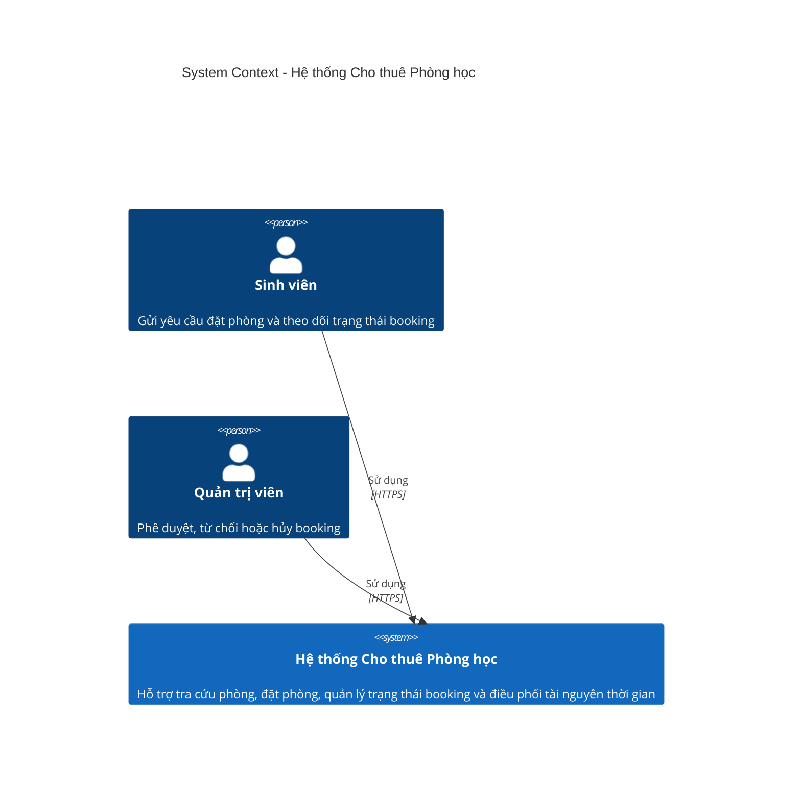
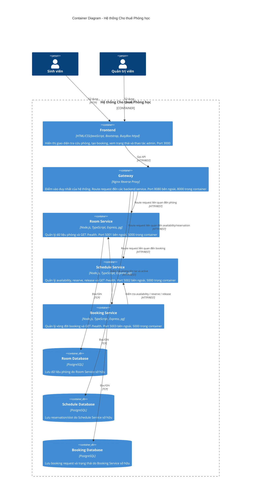
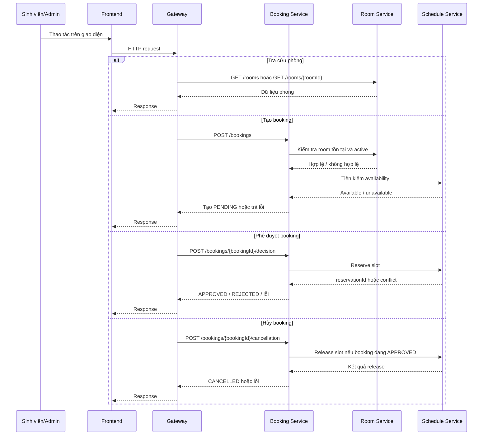

# Kiến trúc Hệ thống

> Tài liệu này được hoàn thiện **sau Phase 1 - Analysis & Design** và dùng để chuyển kết quả phân tích nghiệp vụ sang một kiến trúc triển khai cụ thể.
> Mục tiêu của kiến trúc là: **đúng nghiệp vụ, đủ chặt chẽ để bảo vệ khi nộp bài, dễ triển khai bằng Docker Compose, và phù hợp với nhóm 3 người bằng cách tách thành 3 service nghiệp vụ**.

**Tài liệu tham khảo:**

1. _Service-Oriented Architecture: Analysis and Design for Services and Microservices_ - Thomas Erl (2nd Edition)
2. _Microservices Patterns: With Examples in Java_ - Chris Richardson
3. _Bài tập - Phát triển phần mềm hướng dịch vụ_ - Hung Dang

---


## 1. Lựa chọn Pattern

### 1.1 Tiêu chí lựa chọn

Pattern được chọn theo các tiêu chí:

- bám đúng business process trong Phase 1
- tách đúng 3 service nghiệp vụ để chia cho 3 người
- dễ triển khai trên Docker Compose
- tránh các thành phần phức tạp không cần thiết
- dễ đối chiếu giữa tài liệu phân tích, kiến trúc, API spec và code

### 1.2 Bảng lựa chọn pattern

| Pattern                           | Chọn? | Suy ra từ bước phân tích nào                                               | Giải thích nghiệp vụ / kỹ thuật                                                                                                                        |
| --------------------------------- | ----- | -------------------------------------------------------------------------- | ------------------------------------------------------------------------------------------------------------------------------------------------------ |
| API Gateway                       | Có    | Phase 1 - luồng tương tác client, `AGENTS.md`, `student-guide.md`          | Frontend không gọi trực tiếp backend service. Gateway là điểm vào duy nhất, giúp route request rõ ràng, dễ quản lý, dễ bảo vệ kiến trúc microservices. |
| Database per Service              | Có    | Phase 1 - NFR về Scalability, Availability, Consistency; `AGENTS.md`       | Mỗi service sở hữu dữ liệu riêng để tránh coupling, tăng tính độc lập và đúng tinh thần microservices.                                                 |
| Shared Database                   | Không | Mâu thuẫn với service ownership trong Phase 1 và ràng buộc của `AGENTS.md` | Nếu dùng chung database thì ranh giới service bị phá vỡ, khó chứng minh tính độc lập của từng service nghiệp vụ.                                       |
| Saga                              | Không | Phase 1 - luồng nghiệp vụ ngắn, ít bước, đồng bộ                           | Quy trình booking hiện tại đủ nhỏ để xử lý bằng REST đồng bộ. Dùng Saga sẽ làm giải pháp phức tạp quá mức cần thiết.                                   |
| Event-driven / Message Queue      | Không | Phase 1 - service composition chủ yếu theo request/response                | Chưa cần Kafka/RabbitMQ cho phạm vi bài tập. Bổ sung broker sẽ làm Docker Compose khó triển khai và khó demo hơn.                                      |
| CQRS                              | Không | Phase 1 - tải đọc/ghi thấp trong phạm vi đồ án                             | Chưa cần tách riêng read model / write model. Dùng REST đồng bộ sẽ dễ triển khai và dễ chấm hơn.                                                       |
| Circuit Breaker                   | Không | Phase 1 - hệ thống nhỏ, chạy nội bộ Docker Compose                         | Có thể hữu ích trong production lớn, nhưng không cần thiết cho bài tập triển khai cục bộ.                                                              |
| Service Registry / Discovery      | Không | Docker Compose đã cung cấp DNS nội bộ                                      | Các service gọi nhau trực tiếp bằng service names nên không cần Consul/Eureka.                                                                         |
| Synchronous REST giữa các service | Có    | Phase 1 - resource contracts, service composition, `docs/api-specs/*.yaml` | Đây là kiểu giao tiếp đơn giản nhất, dễ test nhất, dễ bám theo OpenAPI, và phù hợp với bài tập.                                                        |

### 1.3 Kết luận pattern

Kiến trúc được chọn là:

- `Frontend -> Gateway -> Backend Services`
- 3 backend service nghiệp vụ giao tiếp bằng **REST đồng bộ**
- mỗi service có **database riêng**
- không dùng broker, không dùng gRPC, không dùng registry

Đây là lựa chọn chặt chẽ nhất cho đồ án vì:

- đúng với phân tích nghiệp vụ
- đủ rõ để chia việc cho 3 người
- dễ code và dễ chạy bằng Docker
- ít rủi ro hơn các kiến trúc phức tạp

---

## 2. Thành phần Hệ thống

### 2.1 Danh sách thành phần triển khai

| Thành phần            | Trách nhiệm                                                                                                            | Công nghệ sử dụng                             | Port                                 |
| --------------------- | ---------------------------------------------------------------------------------------------------------------------- | --------------------------------------------- | ------------------------------------ |
| **Frontend**          | Giao diện cho sinh viên và admin: tra cứu phòng, gửi booking, xem trạng thái, phê duyệt / từ chối / hủy                | HTML, CSS, JavaScript thuần, Bootstrap        | 3000                                 |
| **Gateway**           | Điểm vào duy nhất của hệ thống; route request từ frontend đến các backend service                                      | Nginx Reverse Proxy                           | 8080 bên ngoài, 8000 trong container |
| **Room Service**      | Quản lý thông tin phòng học: mã phòng, tên phòng, sức chứa, trạng thái hoạt động, thông tin mô tả phòng                | Node.js 20 LTS, TypeScript, Express, pg       | 5001 bên ngoài, 5000 trong container |
| **Schedule Service**  | Quản lý availability, reserve slot, release slot, chống trùng lịch ở mức tài nguyên thời gian                          | Node.js 20 LTS, TypeScript, Express, pg       | 5002 bên ngoài, 5000 trong container |
| **Booking Service**   | Quản lý yêu cầu booking, trạng thái booking, phê duyệt / từ chối / hủy, điều phối với room-service và schedule-service | Node.js 20 LTS, TypeScript, Express, pg       | 5003 bên ngoài, 5000 trong container |
| **Room Database**     | Lưu dữ liệu phòng do room-service sở hữu                                                                               | PostgreSQL 16 Alpine                          | 5432 nội bộ, 5433 bên ngoài          |
| **Schedule Database** | Lưu reservation / slot / availability do schedule-service sở hữu                                                       | PostgreSQL 16 Alpine                          | 5432 nội bộ, 5434 bên ngoài          |
| **Booking Database**  | Lưu booking request, trạng thái, quyết định xử lý do booking-service sở hữu                                            | PostgreSQL 16 Alpine                          | 5432 nội bộ, 5435 bên ngoài          |


## 3. Giao tiếp giữa các thành phần


###  Ma trận giao tiếp

| Từ \ Đến             | Frontend | Gateway | Room Service | Schedule Service | Booking Service | Room DB | Schedule DB | Booking DB |
| -------------------- | -------- | ------- | ------------ | ---------------- | --------------- | ------- | ----------- | ---------- |
| **Frontend**         | —        | REST    | —            | —                | —               | —       | —           | —          |
| **Gateway**          | —        | —       | REST         | REST             | REST            | —       | —           | —          |
| **Room Service**     | —        | —       | —            | —                | —               | TCP     | —           | —          |
| **Schedule Service** | —        | —       | —            | —                | —               | —       | TCP         | —          |
| **Booking Service**  | —        | —       | REST         | REST             | —               | —       | —           | TCP        |
| **Room DB**          | —        | —       | —            | —                | —               | —       | —           | —          |
| **Schedule DB**      | —        | —       | —            | —                | —               | —       | —           | —          |
| **Booking DB**       | —        | —       | —            | —                | —               | —       | —           | —          |

---

## 4. Sơ đồ Kiến trúc

### 4.1 Sơ đồ ngữ cảnh hệ thống



### 4.2 Sơ đồ container triển khai



### 4.3 Sơ đồ luồng nghiệp vụ qua các service



---

## 5. Triển khai

Toàn bộ hệ thống được triển khai bằng Docker Compose:

- mỗi thành phần chạy trong container riêng
- các container giao tiếp qua Docker network nội bộ
- toàn hệ thống khởi động bằng:

```bash
docker compose up --build
```

